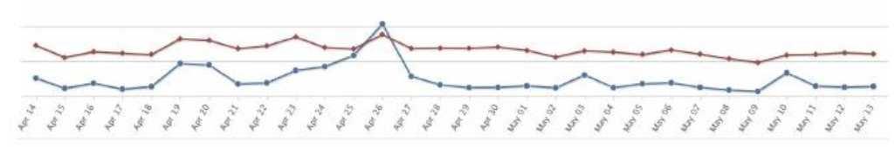

# New applicants skill test 
 
Make a sales dashboard as a very simple and straightforward PHP application to show SQL/PHP/JS skills. There is 
no need to implement all features. More time should be spent on code rather on completing all the tasks. 

## Requirements PHP  
● PHP application should be based on MVC structure  
● Have at least one abstract class and one interface  
● Use namespaces 
● PSR-4 standard (http://www.php-fig.org/psr/psr-4/)  
● No PHP framework should be used  
● Use Bootstrap as layout framework  
● Use any JS library/framework if needed (e.g. JQuery, AngularJS) 

## Create a database structure    
● Order - purchase date, country, device  
● Order items - EAN, quantity, price  
● Customer - first name, last name, email  
● Customer has 1 to many connection with Order  
● Order has 1 to many connection with Order items 
 
   
## Create a simple dashboard that shows statistics for    
● Total number of orders  
● Total number of revenue  
● Total number of customers  
● Statistics by default should be based on last month, with an option to change to any time period (to & from).  
● Create 1 month timeframe chart with customers and orders (something like this - (high charts can be used): 
Example:

